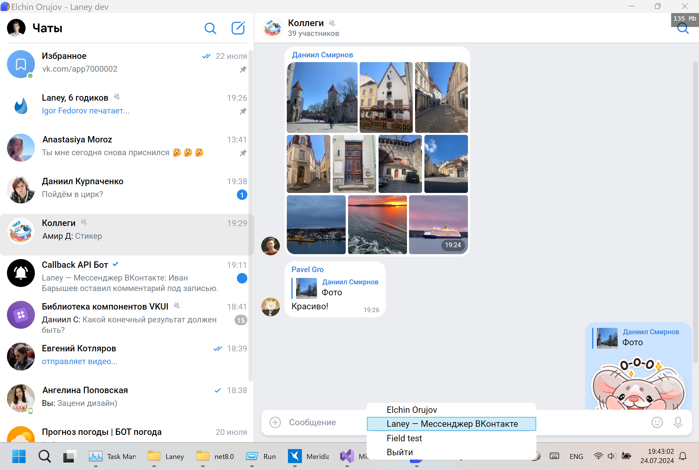

Кросс-платформенная версия Laney — мессенджера ВКонтакте, написанная на фреймворке .NET 8 с использованием UI-фреймворка [Avalonia](https://github.com/AvaloniaUI/Avalonia).



## Перед началом работы
Сначала установите [.NET SDK 8](https://dotnet.microsoft.com/en-us/download/dotnet/8.0) и [PowerShell](https://docs.microsoft.com/en-us/powershell/scripting/install/installing-powershell).

Для проверки корректности установки: `dotnet --version` и `pwsh -v`.

## Клонирование и запуск
```
git clone https://github.com/Elorucov/Laney-Avalonia.git
cd Laney-Avalonia/L2
dotnet run
```

## Сборка
Запустите скрипт `build_aot.ps1`, находящийся в папке **L2**: `pwsh .\build_aot.ps1` на Windows или `pwsh ./build_aot.ps1` на Linux/macOS.
Скрипт скомпилирует релизную версию программы (т. е. выполнит `dotnet publish -c Release`), автоматически увеличивая номер сборки после компиляции. Для Windows и macOS будут скомпилированы x86-64 и arm64-версии, для Linux — только x86-64. 32-битные версии не поддерживаются.

Скрипт в конце выведет путь к скомпилированной программе.

> **Обратите внимание:** скрипт скомпилирует бинарник только для той ОС, на которой запущен скрипт.

Скрипту можно передавать аргумент `channel`, доступны два значения: `BETA` и `RELEASE`.
```
pwsh ./build_aot.ps1 -channel RELEASE
```

## Локальная папка по умолчанию
Это папка, где Laney хранит свои данные: файл с настройками и токеном, логи и кэш. В Windows она находится по адресу `C:\Users\<User>\AppData\Local\ELOR\Laney\`, в macOS — `/Users/<User>/.local/share/ELOR/Laney`, в Linux — `$HOME/.local/share/ELOR/Laney`.

Местоположение папки можно менять, для этого надо запускать Laney с аргументом командной строки `-ldp=<path>`, где `<path>` — это путь к папке (например, `laney.exe -ldp=D:\custom\folder\for\my\fake\account\`)

Таким образом, например, вы можете создавать несколько папок для ~~ваших фейков~~ разных пользователей, и дял этих папок одновременно запустить свой экземпляр Laney.


## Демо-режим
В репозитории находится файл `demo.json`. Если скопировать этот файл в локальную папку, то Laney запустится в демо-режиме. В таком случае будут отображаться только те чаты и сообщения, которые были прописаны в файле, а большинство функций становятся недоступной.

Описание файла находится [тут](docs/demomode.md)


## CI/CD
При пуше в ветку beta и release автоматически запустится Action, который соберёт и выложит сборки в разделе Releases. Не забудьте перед пушем сменить версию приложния в `L2.csproj` и в `MacOS_layout\Contents\Info.plist`, для этого можно запустить сборку локально (см. раздел **Сборка**). 
> **Обратите внимание:** из-за того, что скрипт старый, а файл `Info.plist` создан недавно, скрипт не будет автоматически обновлять версию в этом файле. Обновите вручную.

## TODO:
+ (заполню после пуша и проверки, как отображается readme)