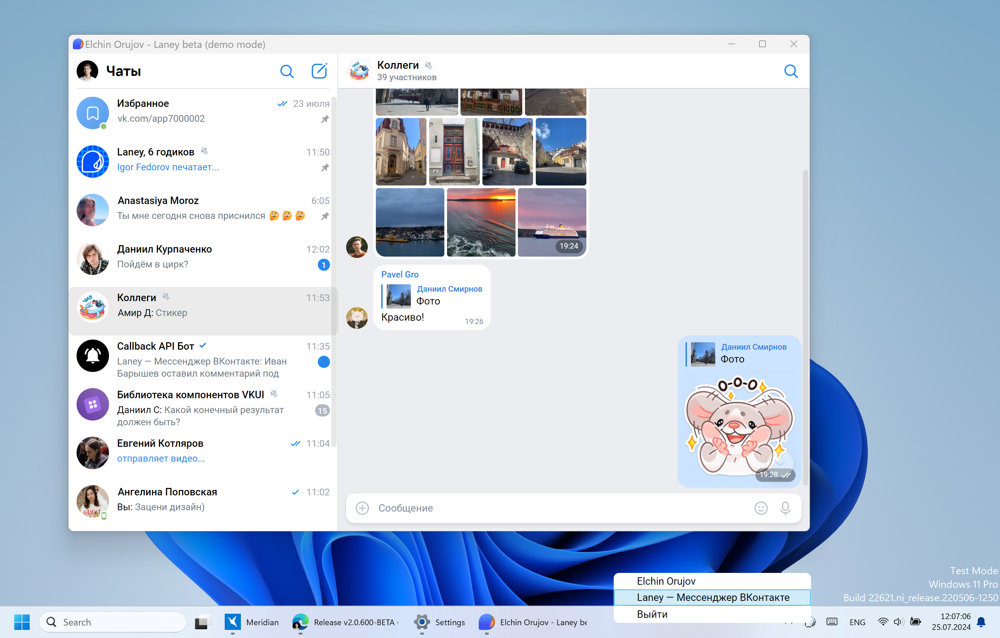

<picture align="center">
  <source media="(prefers-color-scheme: dark)" srcset="docs/logo_dark.png">
  <source media="(prefers-color-scheme: light)" srcset="docs/logo_light.png">
  
</picture>

Это Laney 2 — кроссплатформенная версия Laney, альтернативного мессенджера ВКонтакте, написанная на платформе .NET 8 с использованием UI-фреймворка [Avalonia](https://github.com/AvaloniaUI/Avalonia).

<picture align="center">
  <source media="(prefers-color-scheme: dark)" srcset="docs/windows_dark.png">
  <source media="(prefers-color-scheme: light)" srcset="docs/windows_light.png">
  
</picture>

## О приложении
Первая версия Laney разрабатывается с 2018 года, является UWP-приложением, которое работает на компьютере и смартфоне на Windows 10, и в Xbox.

В связи с желанием разработчика и пользователей иметь кроссплатформенную версию Laney, а также с устареванием платформы UWP, в конце 2021-го года было принято решение написать с нуля новую версию.

Главное отличие Laney от десктопного приложения [VK Мессенджер](https://vk.me/) — мгновенный запуск и быстрая работа приложения, а также более экономное потребление ОЗУ.

> **Обратите внимание:** версия для macOS не подписана. Для запуска введите в терминале `xattr -r -d com.apple.quarantine \Applications\Laney.app`

## Перед началом работы
Сначала установите [.NET SDK 8](https://dotnet.microsoft.com/en-us/download/dotnet/8.0) и [PowerShell](https://docs.microsoft.com/en-us/powershell/scripting/install/installing-powershell).

Для проверки корректности установки: `dotnet --version` и `pwsh -v`.

## Клонирование и запуск
```bash
git clone https://github.com/Elorucov/Laney-Avalonia.git
cd Laney-Avalonia/L2
dotnet run
```

## Сборка
Запустите скрипт `build_aot.ps1`, находящийся в папке **L2**:

- На Windows: `pwsh .\build_aot.ps1`
- На Linux/macOS: `pwsh ./build_aot.ps1`

Скрипт скомпилирует релизную версию программы (т. е. выполнит `dotnet publish -c Release`), автоматически увеличивая номер сборки после компиляции. Для Windows и macOS будут скомпилированы x86-64 и arm64-версии, для Linux — только x86-64. 32-битные версии не поддерживаются.

Скрипт в конце выведет путь к скомпилированной программе.

> **Обратите внимание:** скрипт скомпилирует бинарник только для той ОС, на которой запущен скрипт.

> [!WARNING]  
> На данный момент скрипт не работает корректно на macOS.

Скрипту можно передавать аргумент `channel`, доступны два значения: `BETA` и `RELEASE`.
```powershell
pwsh ./build_aot.ps1 -channel RELEASE
```

## Локальная папка по умолчанию
Это папка, где Laney хранит свои данные: файл с настройками и токеном, логи и кэш. В Windows она находится по адресу `C:\Users\<User>\AppData\Local\ELOR\Laney\`, в macOS — `/Users/<User>/Library/Application Support/ELOR/Laney`, в Linux — `$HOME/.local/share/ELOR/Laney`.

Местоположение папки можно менять, для этого надо запускать Laney с аргументом командной строки `-ldp=<path>`, где `<path>` — это путь к папке (например, `laney.exe -ldp=D:\custom\folder\for\my\fake\account\`)

Таким образом, например, вы можете создавать несколько папок для ~~ваших фейков~~ разных пользователей, и дял этих папок одновременно запустить свой экземпляр Laney.


## Демо-режим
В репозитории находится файл `demo.json`. Если скопировать этот файл в локальную папку, то Laney запустится в демо-режиме. В таком случае будут отображаться только те чаты и сообщения, которые были прописаны в файле, а большинство функций становятся недоступной.

Описание файла находится [тут](docs/demomode.md)


## CI/CD
При пуше в ветку beta и release автоматически запустится Action, который соберёт и выложит сборки в разделе Releases. Не забудьте перед пушем сменить версию приложния в `L2.csproj` и в `MacOS_layout\Contents\Info.plist`, для этого можно запустить сборку локально (см. раздел **Сборка**). 

> [!WARNING]  
> **Обратите внимание:** из-за того, что скрипт старый, а файл `Info.plist` создан недавно, скрипт не будет автоматически обновлять версию в этом файле. Обновите вручную.

## TODO:
На данный момент реализована приблизительно половина функциональности из старой версии Laney, но пока отсутствуют следующие фичи:

+ Горячие клавиши (реализовано только отправка сообщения).
+ Просмотр непрочитанных чатов. В сообществах ещё и важные с неотвеченными.
+ Большинства функций в окне информации о пользователе/сообществе/чате.
+ Системные уведомления. На данный момент Laney отображает уведомления в __своём стиле__.
+ Настройка приватности.
+ Отправка фото и файлов через буфер обмена и drag'n'drop.
+ Все функции фотопросмотрщика (пока он умеет только отображать фото).
+ Проигрыватели аудио и голосовых сообщений, просмотр историй.
+ Поддержка просмотра постов.
+ Опросы и их создание.
+ Просмотр некупленных стикерпаков.
+ Приглашение в чат, а также присоединение в чат по ссылке.
+ Оптимизировать работу приложения с большими кол-вами добавленных сообществ. На данный момент каждое добавленное в приложение сообщество можно запускать в отдельном окне, и они будут одновременно работать. При больших кол-вах добавленных групп (особенно активных) API чаще будет возвращать ошибку 6.
+ Callback-кнопки ботов и карусель (код последнего уже написан)
+ Выбор участника чата после ввода @.
+ Создание аватарок для чатов и статистика чатов.
+ Фичи из VK Мессенджера, которые недоступны сторонним приложениям, но были реализованы в старой версии Laney. (папки, архив и др.)

## Планы на будущее:
+ Выделить проект VKUI в отдельный репозиторий, чтобы другие разработчики могли использовать VKUI в своих Avalonia-приложениях. Возможно, ещё и ELOR.VKAPILib, но пока не планирую.
